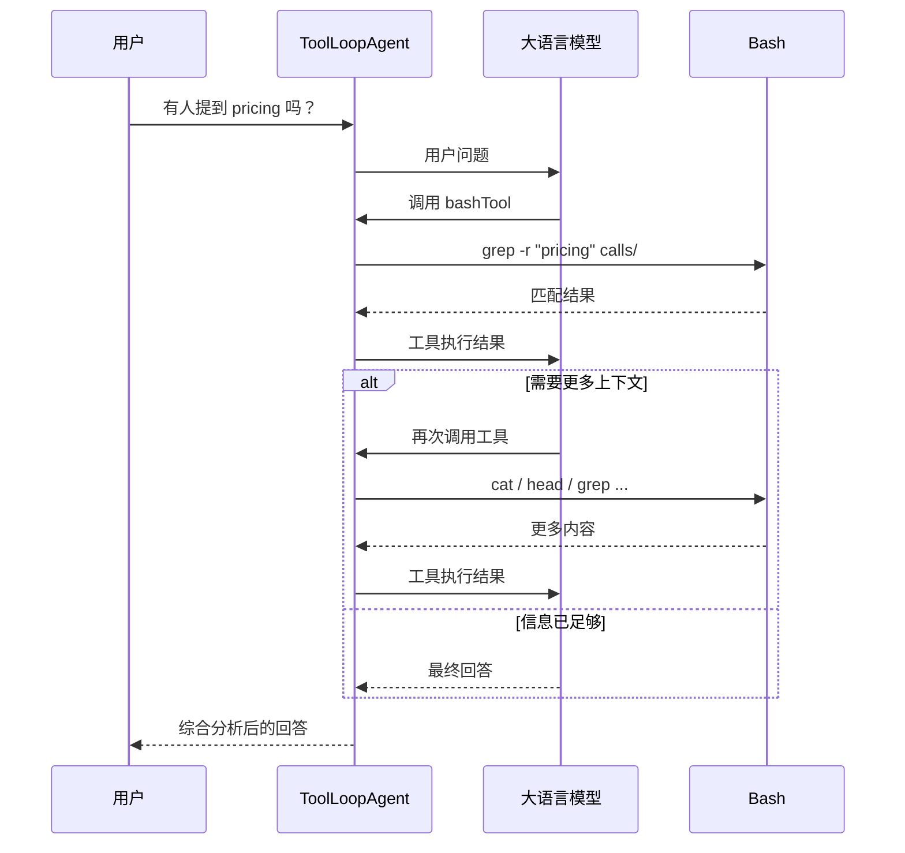

现代大语言模型已经高度适应了“文件 + 目录 + Shell”的工作方式。

通常来说，Agent 的上下文要么直接塞提示词，要么用向量搜索，但提示词填充有上限而向量搜索需要从结构化数据中提取特征值，均存在局限。

而文件系统 Agent 则提供了一种折中方案：将数据以文件形式进行组织，并允许 Agent 使用 Bash 工具（如 find、grep、cat、rg 等），模型就可以复用它在代码导航中已经非常成熟的能力来理解、搜索、关联和修改数据，而无需学习额外的数据库 Schema、SQL 或复杂 API。

文件系统不仅仅是一种存储方式，而是一种与 Agent 工作方式高度契合的数据组织模型：

- 结构即层级：目录和文件本身就是层级关系，不需要额外设计 Schema 或 Metadata 来恢复实体之间的关联。
- 精确检索而非语义相似：grep、find、rg 等工具基于确定性的字符串或路径匹配，适合查找具体事实、标识符和精确文本，而不是依赖语义相似度。
- 上下文按需加载：Agent 通过 Shell 工具逐步定位需要的信息，只把真正相关的内容送入模型，而不是预先加载整个知识库。
- 可调试、可审计：每一步操作（执行了哪些命令、读取了哪些文件、为什么得到最终答案）都是可观察、可复现的。这一点与代码开发的调试体验一致，也是许多现代 Code Agent 选择 Filesystem + Bash + LLM 架构的重要原因。

## Agent 循环



## 创建简单的 Agent 循环

AI SDK 提供了一个 `ToolLoopAgent` 构造函数用来创建一个 agent 循环，只需要传入一个包含 `model`、`instructions` 和 `tools` 的对象即可。

```ts
import { ToolLoopAgent } from "ai";

const MODEL = "deepseek/deepseek-v4-pro";
const INSTRUCTIONS = `
You are a helpful assistant that answers questions about customer calls. Use bashTool to explore the files and find relevant information pertaining to the user's query. Using the information you find, craft a response for the user and output it as text.
`;

export const agent = new ToolLoopAgent({
  model: MODEL,
  instructions: INSTRUCTIONS,
  tools: {},
});
```

此时 Agent 已经可以正常响应输入了：


## 创建 Bash 工具

通过 AI SDK 提供的 `tool` 辅助函数构建一个能够创建 Bash 工具的函数。

`tool` 所需的参数包含：

- `description`：提供对于工具的描述，让模型能够理解该工具能够干什么。
- `inpuSchema`：通过 zod 库来定义工具的输入类型，使用 `.describe()` 方法提供 LLM 所需的字段信息。
- `execute`：定义在工具被调用时的执行逻辑，这里调用 `sandbox.runCommand(command, args)` 方法返回在沙盒环境中的执行结果。

```ts
import { tool } from "ai";
import { z } from "zod";
import type { Sandbox } from "@vercel/sandbox";

export function createBashTool(sandbox: Sandbox) {
  return tool({
    description: `
      Execute bash commands to explore transcript and instruction files.
      Examples (not exhaustive): ls, cat, less, head, tail, grep
      `,
    inputSchema: z.object({
      command: z.string().describe("The bash command to execute"),
      args: z.array(z.string()).describe("Arguments to pass to the command"),
    }),
    execute: async ({ command, args }) => {
      const result = await sandbox.runCommand(command, args);
      const textResults = await result.stdout();
      const stderr = await result.stderr();
      return {
        stdout: textResults,
        stderr: stderr,
        exitCode: result.exitCode,
      };
    },
  });
}
```

## 连接到沙盒环境

通过沙盒环境，能够确保运行大模型的输出的指令时不发生破坏本地环境的操作。

`@vercel/sandbox` 提供了创建线上沙盒环境的能力，在 Vercel 生态中能够快速的接入。

```ts
import { ToolLoopAgent } from "ai";
import { createBashTool } from "./tools";
import { Sandbox } from "@vercel/sandbox";

const MODEL = "deepseek/deepseek-v4-pro";

const sandbox = await Sandbox.create();

export const agent = new ToolLoopAgent({
  model: MODEL,
  instructions: "",
  tools: {
    bashTool: createBashTool(sandbox),
  },
});
```

这时 Agent 能够正常调用 `bashTool` 工具进行命令执行了：


## 配置沙盒环境

通过 `Sandbox.create()` 创建的沙盒环境是一个空白的容器，需用通过 `@vercel/sandbox` 提供的文件上传能力将数据文件上传到沙盒中，Agent 才能基于这些文件进行回答。

```ts
async function loadSandboxFiles(sandbox: Sandbox) {
  const callsDir = path.join(process.cwd(), "lib", "calls");
  const callFiles = await fs.readdir(callsDir);

  for (const file of callFiles) {
    const filePath = path.join(callsDir, file);
    const buffer = await fs.readFile(filePath);
    await sandbox.writeFiles([{ path: `calls/${file}`, content: buffer }]);
  }
}
```

此时 Agent 能够查找到加载到沙盒中的所有文件了：


